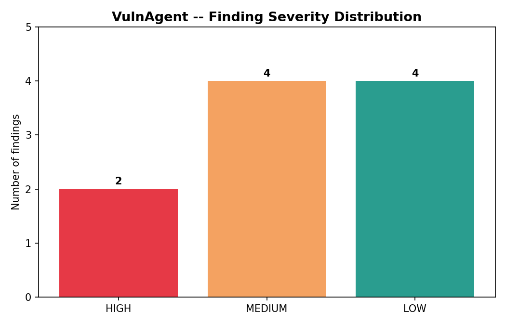

# VulnAgent Triage Report

*Generated: 2026-07-10T21:37:30.401752+00:00*

## Executive Summary

VulnAgent triaged **10 findings**: **10** were auto-triaged (classified, remediated, and drafted as tickets without human involvement), and **0** were escalated to a human reviewer (critical severity and/or low model confidence).

## Severity Distribution



- **HIGH**: 2
- **MEDIUM**: 4
- **LOW**: 4

## Escalated Findings (Human Review Required)

_None -- all findings were auto-triaged._

## Auto-Triaged Findings

### [B404] Consider possible security implications associated with the subprocess...
- **Finding ID**: bandit-0001  
- **Severity**: LOW (CVSS 4.0)  
- **Business impact**: If exploited, an attacker could potentially execute arbitrary commands on the system.  
- **Recommended fix**: Use the subprocess module with caution and validate its output to prevent potential security issues.  
  ```python
  import subprocess
subprocess.run(['ls', '-l'])
  ```
- **Suggested ticket priority**: P2

### [B403] Consider possible security implications associated with pickle module.
- **Finding ID**: bandit-0002  
- **Severity**: LOW (CVSS 4.0)  
- **Business impact**: If exploited, an attacker could inject malicious data into the application, potentially leading to data tampering or even code execution.  
- **Recommended fix**: Use the pickle module with the safe parameter set to True to prevent arbitrary code execution.  
  ```python
  import hashlib
import pickle
import os
# Use pickle.load with safe=True to prevent arbitrary code execution
with open("data.pkl", "rb") as f:
    data = pickle.load(f, encoding=None, fix_imports=True)
    # ...
  ```
- **Suggested ticket priority**: P2

### [B602] subprocess call with shell=True identified, security issue.
- **Finding ID**: bandit-0003  
- **Severity**: HIGH (CVSS 7.0)  
- **Business impact**: If exploited, an attacker could execute arbitrary commands on the system as the current user, potentially leading to unauthorized access or data tampering.  
- **Recommended fix**: Use the subprocess module with the execve function instead of call, which is safer and more secure.  
  ```python
  import subprocess
user_input = input()
subprocess.run(["/bin/sh", "-c", user_input], stdout=subprocess.PIPE, stderr=subprocess.PIPE)

  ```
- **Suggested ticket priority**: P1

### [B324] Use of weak MD5 hash for security. Consider usedforsecurity=False
- **Finding ID**: bandit-0004  
- **Severity**: HIGH (CVSS 6.8)  
- **Business impact**: If exploited, an attacker could obtain the password without needing to compute it, leading to unauthorized access to sensitive data.  
- **Recommended fix**: Use a stronger hash function like bcrypt or Argon2 instead of MD5 for password storage.  
  ```python
  return bcrypt.hashpw(password.encode(), bcrypt.gensalt()).decode()
  ```
- **Suggested ticket priority**: P1

### [B301] Pickle and modules that wrap it can be unsafe when used to deserialize...
- **Finding ID**: bandit-0005  
- **Severity**: MEDIUM (CVSS 4.0)  
- **Business impact**: If this vulnerability is exploited, an attacker could execute arbitrary code on the vulnerable application.  
- **Recommended fix**: Use the safe_load method instead of load to deserialize untrusted data with pickle.  
  ```python
  import pickle
with open(file_path, "rb") as f:
    return pickle.safe_load(f)
  ```
- **Suggested ticket priority**: P2

### [B105] Possible hardcoded password: 'SuperSecret123'
- **Finding ID**: bandit-0006  
- **Severity**: LOW (CVSS 4.0)  
- **Business impact**: If exploited, an attacker could access the application without authentication, potentially leading to unauthorized data access or modification.  
- **Recommended fix**: Replace hardcoded password with environment variable or secure storage.  
  ```python
  password = os.environ.get\("PASSWORD"") or "SuperSecret123"
  ```
- **Suggested ticket priority**: P2

### [B608] Possible SQL injection vector through string-based query construction.
- **Finding ID**: bandit-0007  
- **Severity**: MEDIUM (CVSS 6.0)  
- **Business impact**: If exploited, an attacker could potentially extract sensitive user data or execute arbitrary SQL commands on the database.  
- **Recommended fix**: Use parameterized queries instead of string formatting to prevent SQL injection.  
  ```python
  query = "SELECT * FROM users WHERE id = ?"; cursor.execute(query, (user_id,))
  ```
- **Suggested ticket priority**: P2

### [B108] Probable insecure usage of temp file/directory.
- **Finding ID**: bandit-0008  
- **Severity**: MEDIUM (CVSS 4.0)  
- **Business impact**: If exploited, an attacker could potentially access sensitive data stored in the /tmp directory.  
- **Recommended fix**: Automated remediation generation failed for this finding. Manual review required.  
- **Suggested ticket priority**: P2

### [B605] Starting a process with a shell: Seems safe, but may be changed in the...
- **Finding ID**: bandit-0009  
- **Severity**: LOW (CVSS 4.0)  
- **Business impact**: If exploited, an attacker could execute arbitrary commands as the application, potentially leading to unauthorized access or data tampering.  
- **Recommended fix**: Automated remediation generation failed for this finding. Manual review required.  
- **Suggested ticket priority**: P2

### [B607] Starting a process with a partial executable path
- **Finding ID**: bandit-0010  
- **Severity**: MEDIUM (CVSS 6.8)  
- **Business impact**: If an attacker can manipulate the value of DEBUG, they could potentially execute arbitrary commands on the system.  
- **Recommended fix**: Use the full path to the executable, rather than just the filename, to prevent potential command injection attacks.  
  ```python
  if DEBUG:
    os.system("/path/to/executable -debug mode is on")

  ```
- **Suggested ticket priority**: P2
